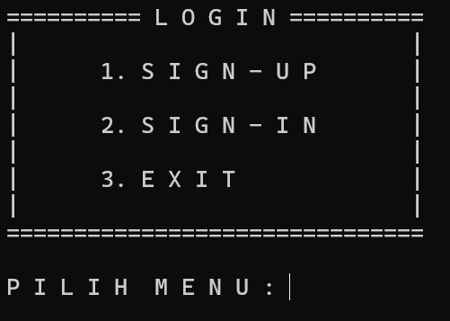
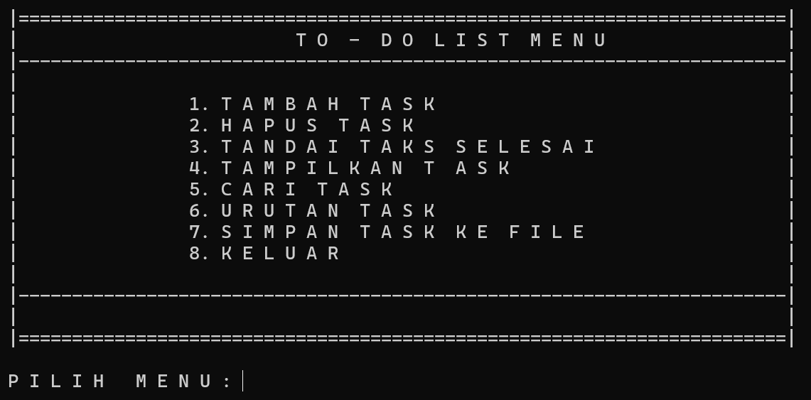

# Simple-To-Do-List

Pada program ini berisikan program to do list sederhana dengan menggunakan bahasa C. Pada program sudah diatur agar dapat mendaftar akun secara sederhana yang nantinya data tersebut dimasukkan kedalam file txt. Setelah itu tugas yang dimasukkan juga akan disimpan kedalam sebuah file txt.

